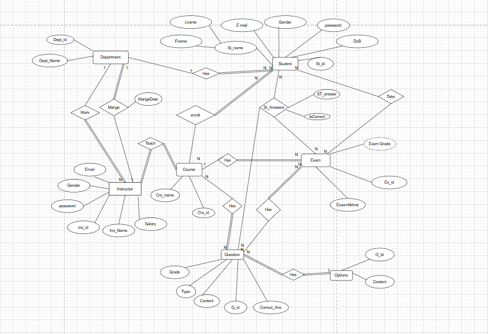
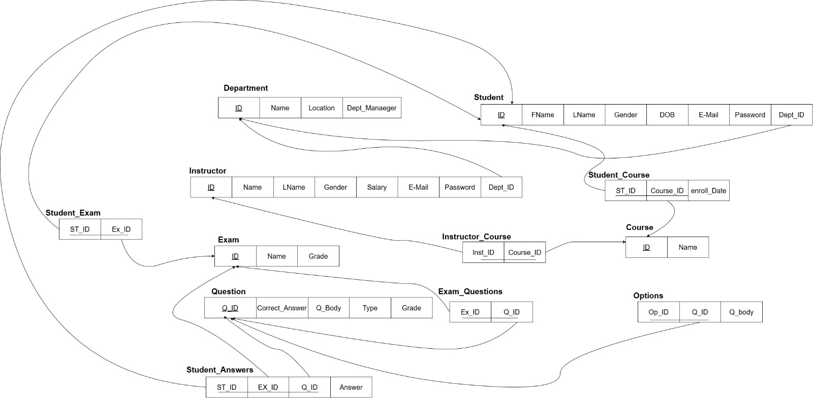
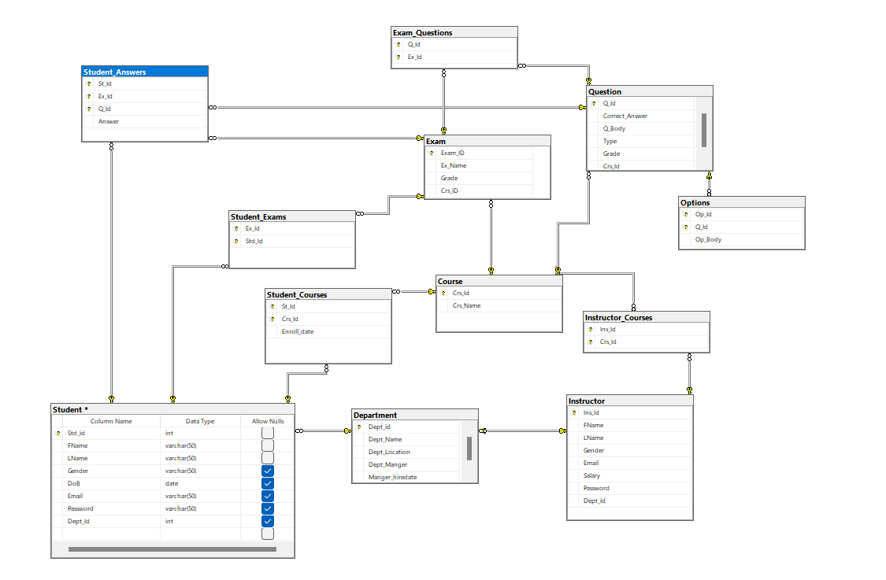

# 🎓 ITI Examination System  
## ITI Examination Database System  

Digital examination systems have revolutionized academic assessments, replacing traditional, error-prone methods with efficient, automated solutions. This **Examination System** streamlines the management of courses, students, instructors, and exams while automating grading and answer evaluation.  

---

## **Key Features** ✨  
- **📚 Course Management**: Easily manage courses and subjects.  
- **👨‍🎓 Student Management**: Track student progress and performance.  
- **👨‍🏫 Instructor Management**: Assign courses and manage exam creation.  
- **📝 Exam Creation**: Create and schedule exams with automated grading.  
- **✅ Answer Evaluation**: Automatically evaluate student answers.  
- **🔒 Secure Authentication**: Ensure secure access for students and instructors.  

---


## **Entity-Relationship Diagram (ERD)** 🔗  
  

---

## **Mapping Diagram** 🔄  
  

---

## **Schema Diagram** 🗃️  
  

---

## **Technologies Used** 🛠️  
-  **SQL Database**  

---

## **Why This Project?**  
This system eliminates manual errors, saves time, and provides a seamless experience for both students and instructors. It’s a modern solution for academic institutions looking to digitize their examination processes.  

---

## **How to Use**  
1. Clone the repository:  
   ```bash  
   git clone https://github.com/your-username/ITI-Examination-System.git  
   ```
2. Navigate to the project directory:  
   ```bash  
   cd ITI-Examination-System  
   ```
3. Install dependencies (if required):  
   ```bash  
   npm install  
   ```
4. Start the application:  
   ```bash  
   npm start  
   ```

---

## **Meet the Team** 👨‍💻👩‍💻  

| Name | GitHub  
|------|--------  
| **Hazem Taha** | [@hazemtaahaa](https://github.com/hazemtaahaa)  
| **Aalaa El-Sayed** | [@member1-github](https://github.com/member1-github)  
| **Menna Hassan** | [@member2-github](https://github.com/member2-github)  
| **Mahmoud Adel** | [@member3-github](https://github.com/member3-github)  
| **Ahmed Samir** | [@member3-github](https://github.com/member3-github)  
| **Abdullah Emad** | [@member3-github](https://github.com/member3-github)  

---

**🚀 Happy Coding!**  
